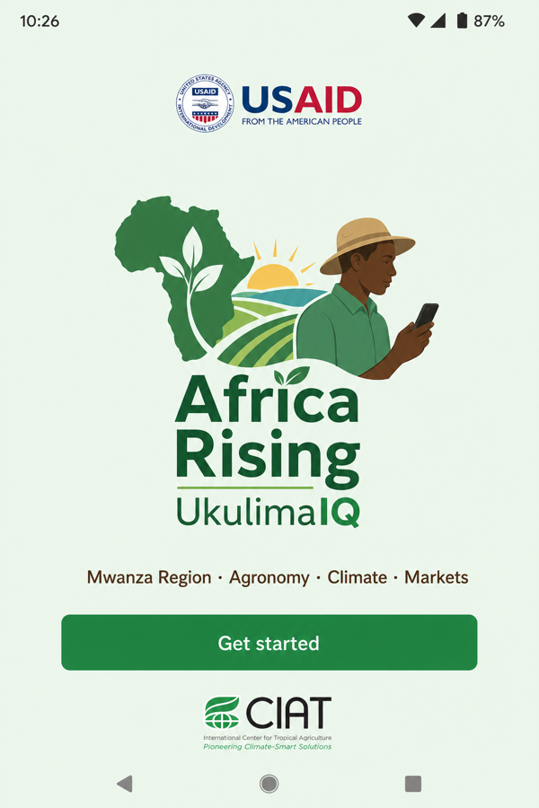
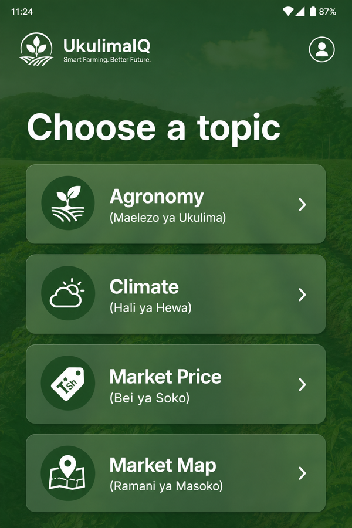
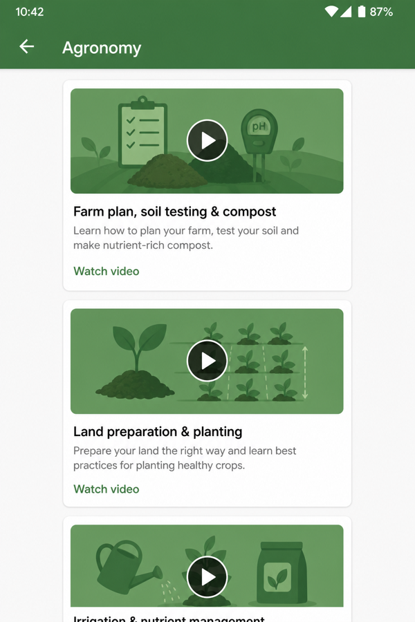
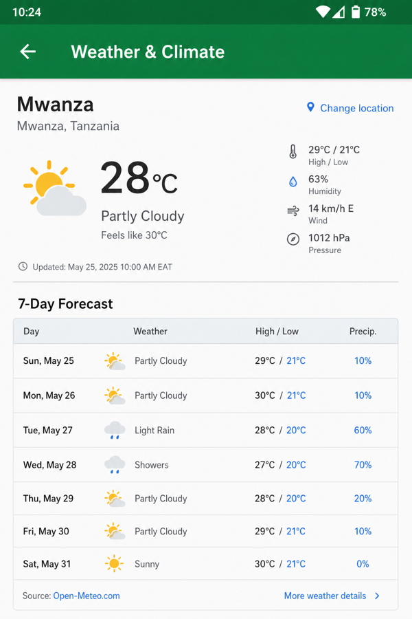
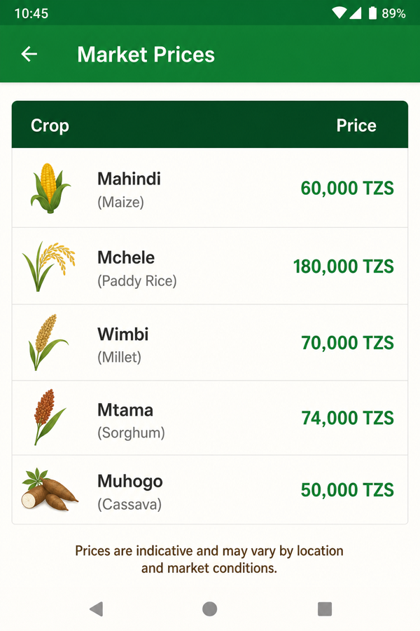
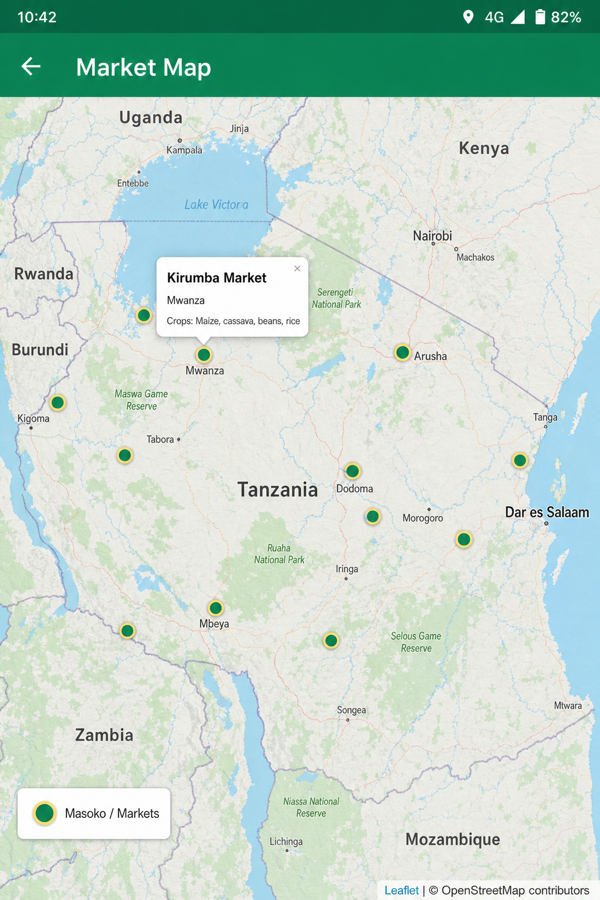

# UkulimaIQ

[](https://kotlinlang.org/)
[](https://developer.android.com/)
[](https://developer.android.com/studio/releases/platforms)
[](https://developer.android.com/google/play/requirements/target-sdk)
[](https://m3.material.io/)
[](https://leafletjs.com/)
[](CHANGELOG.md)
[](#tests)
[](https://github.com/PondiB/UkulimaIQ)

Farming intelligence for farmers in the **Mwanza Region of Tanzania** — agronomy guidance, weather, market prices, and a map of agricultural markets.

<p align="center">
  
  
  
</p>
<p align="center">
  
  
  
</p>

## Screenshots

| Splash | Menu | Agronomy |
|:---:|:---:|:---:|
|  |  |  |

| Climate | Market prices | Market map |
|:---:|:---:|:---:|
|  |  |  |

## Features

1. **Agronomy** (`Maelezo ya Ukulima`) — educational farming videos (opens in YouTube)
2. **Climate** (`Hali ya Hewa`) — Mwanza weather forecast (Yr.no)
3. **Market prices** (`Bei ya Soko`) — reference crop prices for planning
4. **Market map** (`Ramani ya Masoko`) — Leaflet map of agricultural markets across Tanzania

## Stack (v1.1.0)

| Area | Choice |
|------|--------|
| Language | Kotlin 2.0 |
| UI | Material 3 + ViewBinding |
| Architecture | Activities · ViewModels · repositories |
| Map | Leaflet + OpenStreetMap (WebView assets) |
| Build | AGP 8.7 · Gradle version catalog |
| SDK | min 21 · compile/target 35 |

## Project layout

```
app/src/main/
  assets/map/     # Leaflet market map (index.html, markets.js)
  kotlin/.../
    domain/       # AgronomyVideo, MarketPrice
    data/         # repositories
    ui/           # main, menu, agronomy, climate, prices, map
  res/values-sw/  # Swahili strings
```

## Build

**Prerequisites:** Android Studio Hedgehog+, JDK 17, Android SDK 35

```bash
git clone https://github.com/PondiB/UkulimaIQ.git
cd UkulimaIQ
./gradlew assembleDebug
```

Open the project in Android Studio, sync Gradle, then run on a device or emulator.

## Tests

Unit tests cover domain models, repository mapping, and WebView host allowlists (map + weather).

```bash
./gradlew testDebugUnitTest
```

| Area | What’s covered |
|------|----------------|
| `AgronomyVideo` / `MarketPrice` | URL helpers, data class behavior |
| `AgronomyRepository` / `MarketPriceRepository` | Array → model mapping, missing metadata |
| `MapRepository` / `WeatherRepository` | Allowed hosts, Mwanza forecast URL |

### Release signing

Do **not** commit keystores. Create a local `keystore.properties` (gitignored) if you need release builds:

```properties
storeFile=../path/to/your.keystore
storePassword=...
keyAlias=...
keyPassword=...
```

## Localization

Default strings are English; Swahili overrides live in `res/values-sw/`.

## Partners

Built with support context from USAID / CIAT branding assets included in the app.

## Changelog

See [CHANGELOG.md](CHANGELOG.md) for v1.1.0 modernization notes.
